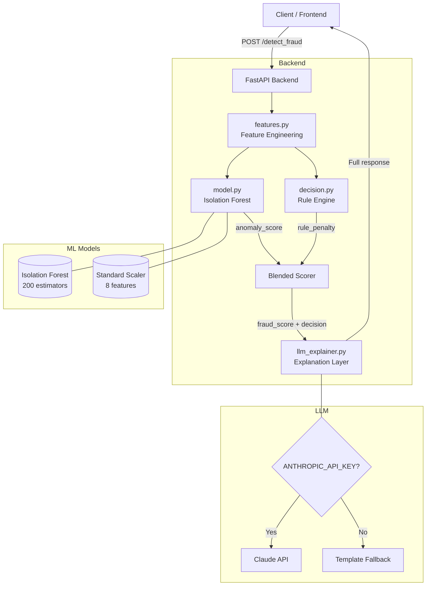

# ⚡ RiskPulse AI — Real-Time Fraud Detection System

> **Santhosh's production-grade fraud detection platform** combining Isolation Forest anomaly detection, a deterministic rule engine, and an optional LLM explanation layer — with a sleek industrial-cyber UI.

[](https://python.org)
[](https://fastapi.tiangolo.com)
[](https://scikit-learn.org)
[](https://docker.com)

---

## 🎯 Project Overview

RiskPulse AI is a **complete, production-ready fraud detection system** that analyses financial transactions in real time using a three-layer approach:

| Layer | Technology | Purpose |
|-------|-----------|---------|
| **ML Anomaly** | Isolation Forest | Unsupervised anomaly scoring |
| **Rule Engine** | Custom deterministic rules | Explainable, auditable decisions |
| **LLM Layer** | Claude / Template fallback | Human-readable explanation generation |

The system returns three outputs per transaction:
- `fraud_score` — blended 0–1 risk score
- `decision` — **APPROVE** / **REVIEW** / **BLOCK**
- `explanation` — plain-English reasoning

---

## 🏗️ Architecture



### Feature Vector (8-dimensional)
```
[0] log(amount)          — Log-transformed transaction amount
[1] sin(hour × 2π/24)    — Cyclical hour encoding (sin)
[2] cos(hour × 2π/24)    — Cyclical hour encoding (cos)
[3] location_entropy     — User-specific location novelty score
[4] device_risk          — Device type risk tier
[5] velocity_score       — Normalised tx count in last hour
[6] country_risk         — ISO country risk classification
[7] card_age_risk        — Inverse of card age (new = risky)
```

### Decision Thresholds
```
fraud_score ≥ 0.72  →  BLOCK   🚨
fraud_score ≥ 0.42  →  REVIEW  ⚠️
fraud_score  < 0.42 →  APPROVE ✅
```

---

## 📁 Project Structure

```
santhosh-riskpulse-ai/
│
├── backend/
│   ├── main.py              # FastAPI app, /detect_fraud endpoint
│   ├── model.py             # Isolation Forest ML model
│   ├── features.py          # Feature engineering pipeline
│   ├── decision.py          # Rule engine & decision logic
│   ├── llm_explainer.py     # LLM explanation layer (Claude)
│   ├── requirements.txt     # Python dependencies
│   └── Dockerfile           # Backend container
│
├── frontend/
│   └── index.html           # Single-file React-less UI (HTML+CSS+JS)
│
├── data/
│   └── sample_transactions.csv   # 30 labelled sample transactions
│
├── docker/
│   └── nginx.conf           # Nginx config for frontend container
│
├── docker-compose.yml       # Full stack Docker orchestration
└── README.md
```

---

## 🚀 Quick Start

### Option 1: Docker (Recommended)

```bash
# 1. Clone the repository
git clone https://github.com/santhosh/<repo-name>.git
cd santhosh-riskpulse-ai

# 2. (Optional) Set your Anthropic API key for LLM explanations
export ANTHROPIC_API_KEY=sk-ant-...

# 3. Start the full stack
docker compose up --build

# Frontend: http://localhost:3000
# Backend API: http://localhost:8000
# Swagger docs: http://localhost:8000/docs
```

### Option 2: Local Development

```bash
# ── Backend ──────────────────────────────────────────
cd backend
python -m venv .venv
source .venv/bin/activate        # Windows: .venv\Scripts\activate
pip install -r requirements.txt

# Optional: set LLM key
export ANTHROPIC_API_KEY=sk-ant-...

uvicorn main:app --reload --port 8000

# ── Frontend (separate terminal) ─────────────────────
# Simply open frontend/index.html in your browser, or:
cd frontend
python -m http.server 3000
# Visit http://localhost:3000
```

---

## 🔌 API Reference

### `POST /detect_fraud`

Analyse a transaction for fraud risk.

**Request Body:**
```json
{
  "amount": 4500.00,
  "user_id": "user_9182",
  "device_type": "mobile",
  "country_code": "NG",
  "latitude": 6.5244,
  "longitude": 3.3792,
  "tx_count_1h": 6,
  "card_age_days": 12,
  "hour": 3,
  "merchant_name": "Global Electronics",
  "merchant_category": "electronics"
}
```

**Response:**
```json
{
  "transaction_id": "a3f1c2d4-...",
  "timestamp": "2025-01-15T03:42:11.123Z",
  "fraud_score": 0.8721,
  "anomaly_score": 0.7834,
  "decision": "BLOCK",
  "explanation": "This transaction was blocked due to multiple simultaneous high-risk indicators...",
  "triggered_rules": [
    "Very large transaction ($4,500.00)",
    "Unusual transaction hour (03:00)",
    "High-risk originating country (NG)",
    "High velocity (6 txns in last hour)",
    "Card issued only 12 day(s) ago"
  ],
  "risk_factors": { ... },
  "processing_ms": 12.4
}
```

**Field Definitions:**

| Field | Type | Range | Description |
|-------|------|-------|-------------|
| `amount` | float | > 0 | Transaction amount in USD (required) |
| `device_type` | string | mobile/desktop/tablet/unknown | Device used |
| `country_code` | string | ISO 3166-1 alpha-2 | Transaction origin country |
| `tx_count_1h` | int | ≥ 0 | Transactions by this user in the last hour |
| `card_age_days` | int | ≥ 0 | Days since card was issued |
| `hour` | int | 0–23 | Hour of day (defaults to current UTC hour) |
| `latitude` | float | −90 to 90 | Merchant location latitude |
| `longitude` | float | −180 to 180 | Merchant location longitude |

### Other Endpoints

| Method | Path | Description |
|--------|------|-------------|
| GET | `/` | Health check |
| GET | `/health` | Detailed health status |
| GET | `/logs?limit=20` | Recent detection results |
| GET | `/stats` | Aggregate statistics |
| DELETE | `/logs` | Clear in-memory log |
| GET | `/docs` | Swagger UI |

---

## 🧪 Testing with cURL

```bash
# Safe transaction
curl -X POST http://localhost:8000/detect_fraud \
  -H "Content-Type: application/json" \
  -d '{"amount": 49.99, "device_type": "desktop", "country_code": "US", "tx_count_1h": 0, "card_age_days": 730}'

# High-risk transaction
curl -X POST http://localhost:8000/detect_fraud \
  -H "Content-Type: application/json" \
  -d '{"amount": 12500, "device_type": "unknown", "country_code": "NG", "tx_count_1h": 8, "card_age_days": 5, "hour": 3}'
```

---

## 🎨 Frontend Features

- **Industrial-Cyber UI** with amber accent on dark background
- **3 quick scenario presets**: Safe / Suspicious / High Fraud
- **Random transaction generator** for testing
- **Real-time processing overlay** with animated phase labels
- **Risk indicators**: 🟢 Green / 🟡 Yellow / 🔴 Red
- **Live dashboard** with decision stats and doughnut chart
- **Fraud log table** with last 20 transactions
- **Demo mode**: works offline by simulating results when backend is unavailable
- **Mobile responsive** design

---

## 🤖 ML Model Details

### Isolation Forest
- **Estimators**: 200 trees
- **Contamination**: 5% (expected fraud rate)
- **Features**: 8-dimensional engineered vector
- **Training**: Synthetic dataset (1,900 normal + 100 anomalous)
- **Persistence**: Saved to `backend/models/` via `joblib`

### Rule Engine (7 rules)
| Rule | Max Penalty | Trigger |
|------|-------------|---------|
| Large amount | +0.30 | > $10,000 |
| Unusual hour | +0.18 | Before 4am or after 11pm |
| High velocity | +0.30 | ≥ 8 transactions/hour |
| High-risk country | +0.25 | NG, RU, UA, CN, VN, PK… |
| Unknown device | +0.20 | device_risk ≥ 0.65 |
| New card | +0.25 | Card age < 7 days |
| Location entropy | +0.20 | Entropy > 0.80 |

**Blending formula:**
```
fraud_score = 0.50 × anomaly_score + 0.50 × min(rule_penalty, 0.80)
```

---

## 🔐 Environment Variables

| Variable | Required | Description |
|----------|----------|-------------|
| `ANTHROPIC_API_KEY` | Optional | Enables Claude LLM explanations. Falls back to template if absent. |

---

## 📊 Sample Data

`data/sample_transactions.csv` contains 30 labelled transactions:
- **15 legitimate** — normal amounts, known countries, established cards
- **10 fraudulent** — high amounts, risky countries, new cards, unusual hours
- **5 suspicious** — borderline cases for REVIEW decision

---

## 🛠️ Tech Stack

| Component | Technology |
|-----------|-----------|
| Backend API | FastAPI + Uvicorn |
| ML | scikit-learn (Isolation Forest) |
| Feature engineering | NumPy |
| Model persistence | joblib |
| LLM | Anthropic Claude (optional) |
| Frontend | Vanilla HTML/CSS/JS + Chart.js |
| Containerisation | Docker + Docker Compose |
| Reverse proxy | Nginx |

---

## 📸 Screenshots

> _Open `frontend/index.html` in your browser after starting the backend to see the live UI._

**Form Panel** — Transaction input with scenario presets  
**Result Panel** — Color-coded decision with scores and AI explanation  
**Dashboard** — Live stats and decision distribution chart  
**Log Table** — Real-time fraud detection history  

---

## 📄 License

MIT © Santhosh — Built with ⚡ RiskPulse AI
